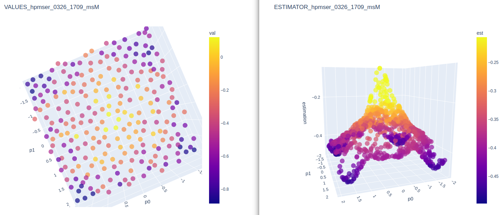

'<!--SKIP_FIX-->'

## HPMSer - Hyper Parameters Search Tool

------------

**HPMSer** is a tool for searching optimal hyper-parameters of any function. Assuming there is a function:

`def some_function(a, b, c, d) -> float`

**HPMSer** will search for values of `a, b, c, d` that MAXIMIZE the return value of the given function.

To start the search process, you will need to create an object of the `HPMSer` class by providing to its `__init__`:
- a `func` (type)
- parameters space definition passed to `func_psdd` (with PSDD - check `pypaq.pms.base.py` for details)
- if some parameters are *known constants*, you may pass their values to `func_const`
- configure `devices`, `n_loops` and optionally other advanced HPMSer parameters

You can check `/examples` for sample run code. There is also a project: https://github.com/piteren/hpmser_rastrigin
that uses **HPMSer**.

------------

**HPMSer** implements:
- smart search with evenly spread out quasi-random sampling of space
- parameters space estimation with regression using SVC RBF (Support Vector Regression with Radial Basis Function kernel)
- space sampling based on current space knowledge (estimation)

**HPMSer** features:
- multiprocessing (runs with subprocesses) with CPU & GPU devices using the 'devices' parameter - check `pypaq.mpython.devices` for details
- exception handling, keyboard interruption without a crash
- automatic process adjustment
- process saving & resuming
- 3D visualisation of parameters and function values
- TensorBoard logging of process parameters

------------

If you have any questions or need any support, please contact me: me@piotniewinski.com